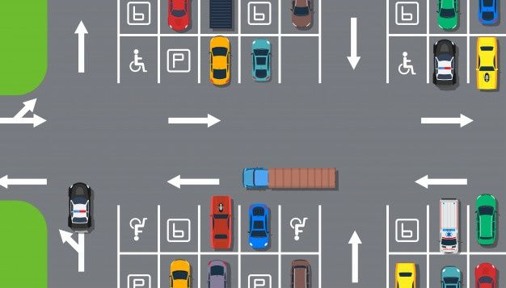

# Ejercicio Parking



## ¿Qué es este repositorio?

Ejercicio propuesto en la clase de programación para manejar Mapas y el concepto de igualdad en Java (.equals() y == así como conocer que es el hashcode).

## Requisitos

Crea un nuevo **paquete** denominado **_collections**.

#### 1.Crea una clase **Test** para probarlo todo.

#### 2.Crea los siguientes **enum**:

  Color
  * Debe incluir los siguientes colores: Rojo  Naranja  Amarillo  Verde  Azul  Índigo  Violeta.
   
  * **Literal**: Abreviatura de 2 letras.
   
  * Devolver por cada literal el nombre completo como String: Ejemplo -> RO:"Rojo".
    
  Marca
  * Debe incluir al menos 5 marcas de coche.
    
  *  **Literal**: Abreviatura de 2 letras.
    
  *  Devolver por cada literal el nombre completo como String: Ejemplo -> WV:"Volskswagen".

#### 3.Crea una clase llamada **Coche**.

  Campos
  * **marca** de tipo **enum**.
    
  * **color** de tipo **enum**.

  Constructores
  * Dados **marca** y **color**.
    
  * Cuando no se indique ningún parámetro, empleará una marca y color aleatorios de entre los posibles.

  Métodos
  * **toString()**: Ejemplo-> Coche SE RO

#### 4.Crea una clase llamada **Parking**.

  Campos  
  * nombre
  
  * totalPlazas
  
  * listaDeCoches

  Constructor
  * Dados el número total de plazas y el nombre.

  Métodos
  * **boolean entraCoche (Coche c)**: Puede entrar cualquier coche mientras haya sitio y no esté ya dentro.
    
  * **boolean saleCoche(Coche c)**: Solo pueden salir coches que ya estén dentro. Si se le pasa un coche que no está dentro, devolverá **false** y si el parking está vacío también devolverá ese valor.

  * **boolean saleCocheAleatorio()**: Solo en el caso de que no haya coches en el parking dará **false**.

  * **boolean vaciarParking()**: Debe sacar todos los coches del Parking uno a uno. Devuelve **false** si ya estaba vacío.

  * **void reportParking()**: Muestra un listado de coches como el indicado en el ejemplo a continuación:
    ```diff
    LISTADO COCHES
    
    Parking: Mi primer parking
      Coche: WV IN
      Coche: ME AM
      Coche: BM RO
      Coche: WV AM
      Coche: BM IN
      Coche: SE NA
      Coche: ME VE
      Coche: SE RO
    Total coches: 8, plazas libres: 2.

> ⚠️ IMPORTANTE
> 
> Crea los métodos que necesites para generar los report que se indican a continuación.

#### 5. En la clase Parking:

  * Añade un campo de tipo Map para almacenar y mantener la información del número de coches que hay de cada color. Modifica constructor y campos de entrada y salida de coches para que se mantenga actualizado en cada operacion.

  * Crea un método llamado **void reportColores()** para obtener un listado como el que puedes ver a continuación (observa que detecta si es plural o singular el número de veces que se repite (vez/veces)):
    ```diff
    REPORT DE COLORES

    Parking: Mi primer parking
    El coche de color amarillo se repite 1 veces.
    El coche de color verde se repite 1 veces.
    El coche de color azul se repite 4 veces.
    El coche de color rojo se repite 2 veces.
    Total coches: 8

  * Añade un campo de tipo Map para almacenar y mantener la información del número de coches que hay de cada marca. Modifica constructor y métodos de entrada y salida de coches para que se mantenga actualizado en cada operación.

  * Crea un método llamado **void reporMarcas()** para obtener un listado como el que puedes ver a continuación (observa que detecta si es plural o singular el número de veces que se repite (vez/veces)):
    ```diff
    REPORT DE MARCAS

    Parking: Mi primer parking
    El coche de marca Seat se repite 3 veces.
    El coche de marca Volvo se repite 1 vez.
    El coche de marca Mercedes se repite 1 vez.
    El coche de marca Volkswagen se repite 1 vez.
    El coche de marca BMW se repite 2 veces.
    Total coches: 8

* Añade un campo de tipo Map para almacenar y mantener la información del número de coches que hay de cada tipo. Modifica constructor y campos de entrada y salida de coches para que se mantenga actualizado en cada operación.

* Crea un método llamado **void reportCochesIguales()** para obtener un listado como el que puedes ver a continuación (observa que detecta si es plural o singular el número de veces que se repite (vez/veces)):
    ```diff
  REPORT DE COCHES IGUALES

  Parking: Mi primer parking
  Coche: VO VE se repite 1 vez.
  Coche: WV RO se repite 1 vez.
  Coche: BM RO se repite 1 vez.
  Coche: SE AM se repite 1 vez.
  Coche: ME AZ se repite 1 vez.
  Coche: BM AM se repite 1 vez.
  Coche: SE AZ se repite 2 veces.
  Total coches: 8

* Añade un campo de tipo Set para almacenar y mantener la información de la lista de coches que hay de cada tipo (sin indicar su cantidad). Modifica constructor y campos de entrada y salida de coches para que se mantenga actualizado en cada operación.

* Crea un método llamado **void reportSetCoches()** para obtener un listado como el que puedes ver a continuación:
    ```diff
  REPORT SET DE COCHES
  
  Parking: Parking Java
  Coche: ME RO
  Coche: ME AZ
  Total items: 2

## Conclusión
El hacer este ejercicio ha tenido tres beneficios importantes:
  * Mejorar en la utilización de estrucutas de mapas y conocer mejor sus métodos.
  * Aprender que significa que algo sea igual frente a que algo sea lo mismo. Es un matiz en el que no había entrado en profundidad hasta ahora.
  * Aprender que es el hashcode y para que se utliza en Java.
